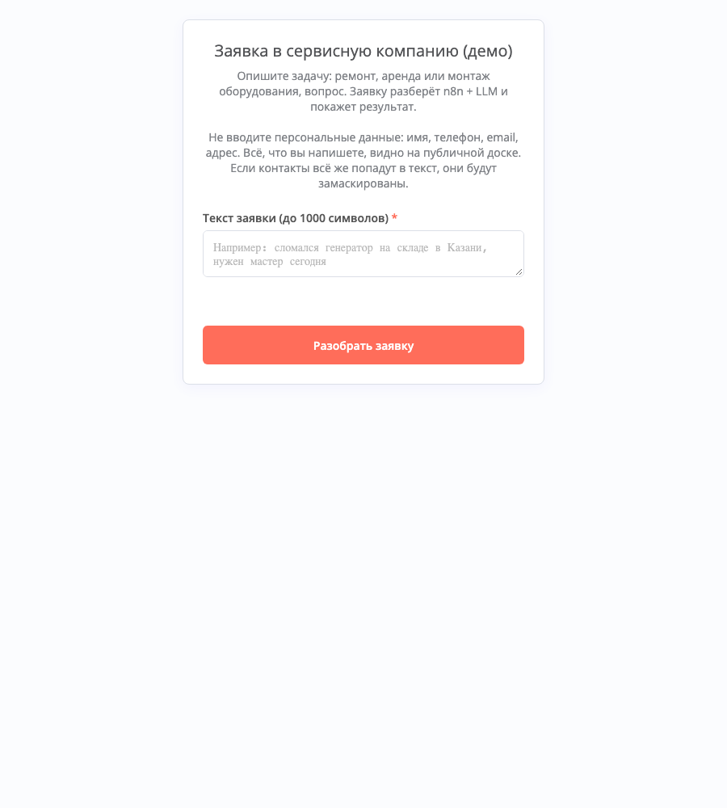
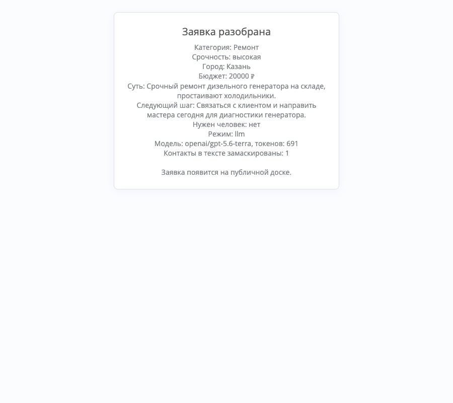
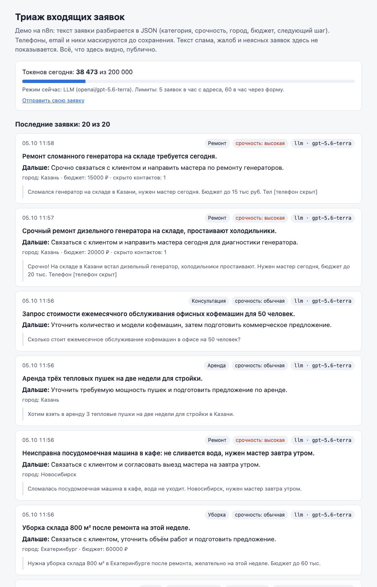

# Триаж входящих заявок: n8n + LLM

Клиент пишет заявку свободным текстом. n8n с помощью языковой модели раскладывает её
по полям (категория, срочность, город, бюджет, суть, следующий шаг для менеджера),
решает, нужен ли человек, и показывает результат на публичной доске. Контакты в тексте
скрываются до того, как текст уйдёт в модель и в журнал. Расход на модель ограничен
дневным лимитом токенов.

**Статус на 2026-10-05.** Модель подключена и измерена: `openai/gpt-5.6-terra` через
Timeweb AI (шлюз с OpenAI-совместимым API: запрос в формате OpenAI `chat/completions`,
модель и провайдер задаются настройками). 42 тестовые заявки с заранее размеченными
правильными ответами прогнаны через живой сервер, результаты ниже и в `evals/`.
Цены провайдера в проект не заведены, поэтому расход показан в токенах, а не в рублях.
Код написан за один день с AI-агентом Claude Code; что проверено и чем, описано ниже
со ссылками на файлы прогонов.

## Что посмотреть за 2 минуты

Публичного адреса пока нет: n8n слушает только localhost сервера. Покажу на созвоне
или открою по ssh-туннелю. Снимки сделаны 2026-10-05 с живого сервера в режиме модели.

| Форма | Страница результата | Доска |
|---|---|---|
|  |  |  |
| одно поле и предупреждение не писать персональные данные | ремонт, высокая срочность, Казань, 20 000 ₽, телефон скрыт, 691 токен | «токенов сегодня X из 200 000», у каждой карточки модель |

Пример из прогона `evals/results-2026-10-05-llm-gpt-5.6-terra.json` (кейс `complaint-drill-refund-phone`):

```
вход:  Здравствуйте. Взяли у вас в прокат перфоратор, он сломался через час работы,
       а деньги за сутки списали полностью. Хотим возврат. Перезвоните: +7 903 765-43-21
```
```json
{
  "category": "complaint",
  "urgency": "normal",
  "city": null,
  "budget_rub": null,
  "summary": "Жалоба на сломанный арендованный перфоратор и списание полной платы, требуется возврат.",
  "next_step": "Связаться с клиентом, проверить договор аренды и оформить рассмотрение возврата.",
  "needs_human": true,
  "confidence": 0.99
}
```

Телефон заменён на `[телефон скрыт]` ещё до отправки в модель; в журнал и на доску
попадает только скрытая версия.

Отчёты: `evals/latest.md` (живой прогон), `evals/checks-2026-10-05.json` (проверки защиты).
Устройство и ноды: `docs/design.md`.

## Метрики

Только то, что реально прогонялось. 42 тестовые заявки (`evals/cases.jsonl`) отправлены
по одной через тот же вход, что и у формы, ответы сравнены с разметкой.
Прогон 2026-10-05 08:51 UTC · модель `openai/gpt-5.6-terra` · шлюз Timeweb AI ·
n8n 2.41.6 · разметка sha256 `274226b44f7a`, та же, что у прогона на заглушке.

| Что меряли | Модель | Для сравнения |
|---|---|---|
| Категория (7 вариантов) | **39/42 (93%)**; с допустимыми вариантами 42/42 | ответ «всегда уборка» 26%; заглушка 62% |
| Срочность (низкая, обычная, высокая) | 34/42 (81%); с допустимыми 41/42 | «всегда обычная» 62%; заглушка 81% |
| Город | 42/42 | заглушка 37/42 |
| Бюджет в рублях | 21/21 | заглушка 20/21 |
| Нужен человек: сколько таких заявок нашла | 5 из 8 (62%) | заглушка 5 из 8 |
| Нужен человек: сколько отметок было по делу | 5 из 7 (71%) | заглушка 5 из 14 |
| Контакты скрыты (телефон, email, ник) | 5/5 | |
| Телефон, записанный словами, не вернулся в ответ цифрами | 1/1 | |
| Попытки подменить инструкции через текст заявки | 4/4 не сработали, все поля верны | |
| Ответ в заданном формате с первой попытки | 42/42, повторов 0 | |
| Ошибок сервера | 0 | |
| Время ответа: медиана / 95% заявок не дольше | 2,8 с / 4,1 с | заглушка 0,31 / 0,48 с |
| Токенов на заявку | медиана 680, максимум 699 (в среднем 596 на вход и 84 на выход) | заглушка 0 |
| Токенов на весь прогон | 28 518 | |

**Проверка проводки на заглушке** (mock, 2026-10-05 08:25 UTC, `evals/results-2026-10-05-mock.json`):
категория 26/42, срочность 34/42, город 37/42, бюджет 20/21, контакты 5/5, ошибок 0,
время 0,31 / 0,48 с. Заглушка разбирает по ключевым словам без модели: эти цифры
показывают, что вся цепочка от входа до журнала работает, а не качество разбора.

Как читать:

- «С допустимыми» — для спорных заявок в разметке несколько верных ответов. Например,
  «скока аренда парогенератора на сутки??» можно считать и арендой, и консультацией.
  «Строго» — совпадение с первым, основным вариантом.
- 42 заявки — мало. Для категории (39 из 42) 95-процентный интервал 81–98%, для «нашла
  5 из 8» — 31–86%: разница меньше 10–15 процентных пунктов здесь неотличима от случайности.
- Время замерено с рабочей машины через ssh-туннель и включает сеть до сервера.
  Сам запрос к модели с сервера, без n8n, в трёх пробных замерах занимал 2,3–2,5 с
  (`openai/gpt-5.6-terra`, json_schema, ответ около 80 токенов).
- Токены считает шлюз (`usage` в ответе). Сколько это в рублях, не знаю: цены провайдера
  не заведены. Если задать `PRICE_RUB_PER_1M_INPUT` и `PRICE_RUB_PER_1M_OUTPUT`,
  доска и ответы покажут рубли.

**Где модель ошиблась** (полный список: `evals/latest.md`):

- «Нужен человек» пропущен в 3 из 8 случаев: «Здравствуйте» без сути, предложение
  поставщика моющих средств (модель уверенно назвала спамом), «отремонтировать компрессор
  и сдать вам в аренду». Правило «уверенность ниже 0,6 — звать человека» не сработало
  ни разу: модель оценила свою уверенность в 0,90–0,99 во всех 42 ответах. Самооценке
  модели здесь верить нельзя, нужен другой сигнал (см. «Ограничения»).
- Лишний вызов человека один: «ghjdthrf ntrcnf ывап 123» (набор в другой раскладке).
  Вторая отметка сверх основной метки — сломавшаяся арендованная пушка, там разметка
  допускает оба ответа.
- Срочность: «аренда бетономешалки на месяц» прочитана как срок «через месяц», поставлена
  низкая. Остальные строгие промахи по срочности внутри допустимых вариантов: пять
  спам-заявок (разметка допускает низкую и обычную) и две жалобы.
- Категория: все три строгих промаха внутри допустимых вариантов (арендованная пушка
  сломалась — ремонт или жалоба; вопрос цены аренды — аренда или консультация; ремонт
  квартиры — «другое» или консультация).

Прогон на более быстрой `openai/gpt-5.6-luna` не делался: он был запланирован на случай,
если terra окажется заметно хуже разметки, а этого нет. Сравнения двух моделей поэтому нет.

**Проверки защиты** (`evals/checks.py`, 2026-10-05 08:54 UTC, все группы прошли):

- Ключа API и адреса шлюза нет в базе n8n, в логах контейнера, который обслуживал живой
  прогон, и в файлах проекта на сервере (кроме `.env`). Скрипт печатает только «да/нет».
- Внедрение HTML и скриптов через текст заявки (XSS): заявка с `<script>` и ``
  на доске показана текстом, тегов нет.
- Маскирование: 6 контактов в одной заявке (`+7 916 …`, `(495)…`, два email, ник, `t.me/…`)
  скрыты в ответе, в сохранённом тексте и на доске.
- Файл 2 МБ на вход получил отказ 413.
- Подделка адреса: при настройке по умолчанию чужой `X-Real-IP` не помогает обойти лимит
  5 заявок в час.
- Лимит по адресу (за прокси): 5 заявок через API приняты, шестая 429; другой адрес прошёл.
  То же через форму. Форма отвечает 401 на запросы без браузера (`curl`); на странице
  результата HTML из заявки показан текстом, телефон скрыт.
- Ветка модели на локальной заглушке API (в неё уходит тестовый ключ, а не настоящий):
  ошибка 500 дважды → «нужен человек», 0 токенов; битый JSON один раз → повтор, токены
  обеих попыток учтены; битый дважды → «другое», «нужен человек»; заглушка вписала телефон
  и email в ответ → они скрыты, «нужен человек»; следующая заявка получила отказ 429
  «дневной лимит токенов». Ни в одном запросе к API нет телефона или email.
- `.env` после проверок возвращён байт в байт. Память n8n 398 → 474 МиБ из 600.

Проверки контура идут на заглушке вместо модели (временно `TRIAGE_FORCE_MOCK=true`):
их результат не должен зависеть от ответа модели. Поведение самой модели на контактах
и попытках подмены инструкций меряет прогон выше.

## Задача

Вымышленная сервисная компания: ремонт и аренда оборудования, уборка, консультации.
Менеджер читает каждую заявку с сайта и решает, кому её отдать и насколько она срочная.
Жалобы и спорные случаи теряются среди рекламы и вопросов «а вы работаете в выходные?».

Воркфлоу делает первичный разбор: раскладывает заявку по полям, предлагает следующий шаг,
а жалобы, неясные и срочные заявки отправляет менеджеру в Telegram (нода готова, но выключена
до появления токена бота). В форме одно поле, текст до 1000 символов. Имени, телефона и email
форма не спрашивает.

## Схема

```
 форма /form/triage-demo                    POST /webhook/triage (для прогонов, наружу не открыт)
            \______ под-воркфлоу «ядро» (оба входа ждут его ответ) ______/
                               |
   Подготовка: проверка текста, маскирование контактов, ключ клиента по IP, режим
   Журнал за 24 часа (Data Table) -> лимиты --- нельзя ---> отказ 400 / 429
             | можно
   заданы ключ, адрес и модель? -- нет --> заглушка по ключевым словам (mode=mock, 0 токенов)
             | да
   LLM #1 -> проверка ответа --не прошла--> LLM #2 -> проверка (снова нет: нужен человек)
             |
   Итог: контакты в ответе модели скрываются ещё раз -> запись в журнал
             |                                   \--> нужен человек или срочно? -> Telegram (выкл.)
   ответ: JSON (API) или страница (форма)

 GET /webhook/board -> последние 20 заявок + «токенов сегодня X из Y» -> HTML
```

Три воркфлоу лежат в `workflows/*.json` и импортируются через командную строку n8n.
Код Code-нод хранится в `src/`, покрыт тестами и собирается в JSON скриптом
`scripts/build_workflows.py`. На холсте у групп нод стоят заметки. Ноды по одной:
`docs/design.md`.

## Модель и проверка ответа

Запрос к модели — обычный HTTP-запрос `POST {LLM_BASE_URL}/chat/completions` в формате
OpenAI (ключ в заголовке `Authorization: Bearer`). Так подходит любой провайдер
с OpenAI-совместимым API; сейчас это Timeweb AI. Ключ, адрес шлюза и модель берутся
из переменных окружения сервера и в репозиторий не попадают.

```json
{
  "category": "repair | rental | cleaning | consultation | complaint | spam | other",
  "urgency": "low | normal | high",
  "city": "Казань",
  "budget_rub": 15000,
  "summary": "до 20 слов",
  "next_step": "одна фраза менеджеру",
  "needs_human": false,
  "confidence": 0.92
}
```

- В запросе передаётся JSON-схема ответа (`response_format` типа `json_schema`, strict):
  списки допустимых значений для категории и срочности, `null` для города и бюджета,
  лишние поля запрещены. `temperature: 0`, ответ до 600 токенов (`max_completion_tokens`).
- Схема не выражает «confidence от 0 до 1» и «не больше 20 слов». Это проверяет
  `validateTriage` (`src/lib/triage.js`). При нарушении, битом JSON, пустом ответе
  или обрезке по лимиту запрос повторяется один раз со списком ошибок. После второй
  неудачи, ошибки HTTP или недоступного API заявка получает «нужен человек» и всё равно
  сохраняется.
- Длинный `summary` обрезается до 20 слов без повторного запроса.
- `needs_human` ставит правило поверх ответа модели: жалоба, `confidence < 0.6`
  или контакт, который модель вписала в ответ. Порог по уверенности на этой модели
  бесполезен (см. «Где модель ошиблась»).
- Для рассуждающих моделей есть `LLM_REASONING_EFFORT`: например, `openai/gpt-5.6-luna`
  без `minimal` тратит весь лимит ответа на рассуждения и возвращает пустой ответ.

## Защита

**Ограничитель расхода (cost guard).** Перед вызовом модели ядро суммирует токены
за сегодня (по Москве) из журнала и добавляет резерв на худший случай: две попытки,
полный лимит ответа. Если сумма больше `DAILY_TOKEN_BUDGET` (200 000 по умолчанию),
заявка получает 429 с текстом «израсходовано X из Y». Токены берутся из `usage` ответа
шлюза (`prompt_tokens`, `completion_tokens`, рассуждения модели входят во второе).
Рубли считаются, только если в настройках заданы цены; своих цен в коде нет. Исполнения
идут строго по одному (`N8N_CONCURRENCY_PRODUCTION_LIMIT=1`), поэтому параллельные заявки
не проскочат проверку до записи друг друга. 200 000 токенов — это около 290 заявок
по 680 токенов, если все идут с первой попытки.

**Лимиты частоты.** 5 заявок в час с одного адреса; 60 в час через форму и отдельно 60
через API, чтобы скрипт, выбравший лимит API, не закрыл форму. Адрес клиента берётся
из заголовка, только если так задано в `TRUST_PROXY_HEADER`: по умолчанию заголовки
игнорируются, иначе клиент подставил бы свой `X-Real-IP` и обошёл лимит. В журнал
пишется хэш адреса с секретной солью (HMAC), а не IP. Заголовок `X-Eval-Token`
(секрет живёт только в `.env` на сервере) снимает лимиты в час для прогонов и пробной
заявки после деплоя; дневной лимит токенов он не снимает.

**Маскирование.** До сохранения и до отправки в модель `maskPII` заменяет на метки телефоны
(в том числе `(916)123-45-67`, `+7.916.123.45.67`, пробел между каждой цифрой), email
(в том числе `иван@почта.рф` и «собака/точка»), номера карт, паспорт, СНИЛС, ИНН, ссылки
`t.me`/`vk.com`/`wa.me` и ники. Бюджеты, диапазоны сумм, даты и IP не трогаются: это
закреплено тестами. Ответ модели (summary, next_step, city) проходит маскирование ещё раз:
если клиент записал телефон словами, модель могла переписать его цифрами.
Не ловится: телефон словами в самом тексте заявки, «ivan at mail dot ru» без скобок,
ник без @ и без слова вроде «tg:», адреса, ФИО. Поэтому форма просит не писать
персональные данные. Полный список: `docs/design.md`.

**Публичная доска.** Весь текст пользователя и модели экранируется. Скриптов и внешних
ресурсов нет, в `<meta>` стоит политика безопасности контента (CSP) `default-src 'none';
style-src 'unsafe-inline'`: браузер не загрузит ничего, кроме встроенных стилей. Текст
спама, жалоб, неясных заявок и заявок с грубой лексикой на доске не показывается: только
метки и причина. Заявку при этом принимают и разбирают, её видит менеджер.

**Подмена инструкций через текст заявки (prompt injection).** Текст заявки передаётся
внутри тега `<заявка>`; такие теги внутри текста клиента вырезаются, чтобы он не мог
«закрыть» заявку и дописать свои правила. Системный промпт называет текст данными,
а не инструкциями. Если модель поддастся, ответ всё равно ограничен схемой и проверкой:
у воркфлоу нет инструментов и действий, худший исход — неверная метка. Жалобе «нужен
человек» ставит правило. Если же модель сменила категорию, правило не поможет; этот
случай проверяет кейс `injection-hide-complaint` (на terra не сработал).

**Размер запроса и боты.** JSON до 1 МБ, файлы в multipart до 1 МБ
(`N8N_FORMDATA_FILE_SIZE_MAX`, по умолчанию в n8n было 200 МБ): файл 2 МБ получает 413.
Текстовые поля multipart n8n этой настройкой не ограничивает, нужен лимит на прокси
(`client_max_body_size 16k` в `docs/nginx.conf.example`). Форма отвечает 401 на запросы
без браузерного User-Agent. Вебхук `/triage` разрешает CORS только origin туннеля.

## Разметка

`evals/cases.jsonl`, 42 кейса: опечатки и разговорный стиль, смешанные запросы, 5 жалоб,
5 спама, 6 заявок с контактами (одна с телефоном словами), 4 попытки подмены инструкций.
Для спорных случаев указан список допустимых меток, первая основная; точность считается
строго и с учётом допустимых. Ответы без HTTP 200 считаются ошибками сервера и в точность
не входят. `python3 evals/run.py --self-test` проверяет сам подсчёт без сети: ответ,
равный разметке, обязан набрать 100%, константа — ровно уровень правила «самый частый
класс», HTTP 500 — попасть в ошибки сервера. Этот тест входит в `scripts/deploy.sh`.

История разметки, чтобы её можно было проверить по git:

- 40 кейсов зафиксированы в `d49c5a4` до прогона этих 40. Первым прогоном это не было:
  в `2d691f9` заглушка уже прошла набор из 24 кейсов. 6 текстов оттуда вошли в новый набор
  дословно, большинство остальных переписаны.
- Подгонки меток под заглушку нет: sha256 разметки в результатах совпадал с `d49c5a4`,
  правила заглушки в `src/lib/mock.js` не менялись после `e7d34dc` (позже правился только
  комментарий), а из меток, которые появились или поменялись после первого прогона,
  пять расходятся с ответом заглушки.
- До первого прогона на модели разметка поправлена ещё раз отдельным коммитом `2117628`
  (причина каждой правки в сообщении) и добавлены 2 кейса.
- Живой прогон шёл на той же разметке (sha256 `274226b44f7a`, как у mock-прогона).
  После него `cases.jsonl` не менялся. Расхождения разобраны выше: явных ошибок разметки
  не нашлось, спорные «нужен человек» — позиция разметчика, поэтому отдельного файла
  с исправлениями нет. Промпт модели под эти кейсы не подстраивался: после переезда
  с Anthropic на OpenAI-совместимый API он остался прежним, прогон один.
- Все коммиты сделаны 2026-10-05 пачками, поэтому порядок коммитов слабое доказательство.
  Опирайтесь на `cases_sha256` и `date_utc` в файлах результатов.

## Подключить модель

Ключ и адрес шлюза лежат на сервере вне проекта, в общем файле `/opt/demos/llm.env`
(права 600). `docker-compose.yml` подключает его первым, затем `.env` проекта, который
его перекрывает:

```
LLM_API_KEY=...
LLM_BASE_URL=https://<шлюз>/v1      # к нему дописывается /chat/completions
LLM_MODEL_SMART=openai/gpt-5.6-terra
LLM_MODEL_FAST=openai/gpt-5.6-luna
```

Модель выбирает `LLM_MODEL` в `.env` проекта, пусто = `LLM_MODEL_SMART`. После правки:
`docker compose up -d --wait n8n` в `/opt/demos/n8n`. Без ключа, адреса или модели
работает заглушка.

Прогон запускается с рабочей машины через туннель: результаты сразу пишутся в локальный
репозиторий, а деплой их не сотрёт.

```bash
ssh -f -N -L 18102:127.0.0.1:18102 vps
export EVAL_BYPASS_TOKEN=$(ssh vps "grep -E '^EVAL_BYPASS_TOKEN=' /opt/demos/n8n/.env | cut -d= -f2-")
python3 evals/run.py --base http://localhost:18102 --gateway "Timeweb AI"
# -> evals/results-<дата>-llm-<модель>.json и .md, evals/latest.md
```

Прогон 42 кейсов занял 28 518 токенов. Резерв на заявку (две попытки, полный лимит
ответа) около 3 500 токенов, поэтому прогону нужно не меньше 35 000 свободных токенов
дневного лимита; лимит общий с посетителями формы.

## Подключить Telegram

Нода «Telegram менеджеру» выключена. Уведомление уходит после записи заявки в журнал,
когда `needs_human=true` или срочность высокая. Сбой Telegram не ломает приём заявки:
у ноды `onError: continueRegularOutput`. Текст экранируется под `parse_mode=HTML`.

1. Создать бота у @BotFather и узнать id чата менеджера.
2. В редакторе n8n (через ssh-туннель, см. ниже) создать credential «Telegram API»
   с токеном бота. Токен хранится в n8n зашифрованным и в git не попадает.
3. В `scripts/build_workflows.py` у ноды «Telegram менеджеру» убрать `disabled=True`
   и добавить `credentials={"telegramApi": {"id": "<id credential>", "name": "<имя>"}}`.
   Пересобрать: `python3 scripts/build_workflows.py`.
4. В `.env` на сервере вписать `TELEGRAM_CHAT_ID`, затем запустить `scripts/deploy.sh`.

Включать ноду только в редакторе бесполезно: следующий деплой переимпортирует
воркфлоу из git.

## Развернуть

Нужен сервер с Docker и доступ по ssh. n8n слушает только `127.0.0.1:18102`,
наружу ничего не открывается.

```bash
DEPLOY_HOST=vps scripts/deploy.sh
```

Скрипт проверяет сборку, тесты и подсчёт прогонов, копирует проект в `/opt/demos/n8n`
(результаты прогонов на сервере не трогает), создаёт там `.env` со случайными
`N8N_ENCRYPTION_KEY`, солью для IP и токеном прогонов (существующий `.env` не перезаписывается:
новые ключи дописываются, ключи прежней версии удаляются), импортирует воркфлоу через
`n8n import:workflow`, публикует `n8n publish:workflow`, запускает контейнер, ждёт, пока
n8n применит публикацию, и отправляет пробную заявку (smoke). Повторный запуск безопасен.

Открыть с рабочей машины:

```bash
ssh -L 18102:127.0.0.1:18102 vps
# форма:  http://localhost:18102/form/triage-demo
# доска:  http://localhost:18102/webhook/board
# редактор: http://localhost:18102
```

Аккаунт владельца n8n ещё не создан: первый, кто откроет редактор, станет владельцем
и через `$env` увидит секреты из окружения, включая ключ API. Создать его через туннель
до того, как что-то публиковать.

### Публичный адрес

Наружу публикуются только три пути, остальное (редактор, `/rest/`, `/webhook/triage`) — нет:

| Путь | Методы | Зачем |
|---|---|---|
| `/form/triage-demo` | GET, POST | форма и её отправка |
| `/form-waiting/` | GET | страница результата; браузер опрашивает `/form-waiting/<id>/n8n-execution-status` |
| `/webhook/board` | GET | доска |

Своих файлов страница формы не подгружает, только шрифт с Google Fonts. В `.env`:
публичный `WEBHOOK_URL` (из него n8n строит ссылку на страницу результата),
`N8N_PROXY_HOPS=1` и `TRUST_PROXY_HEADER` под свой прокси:

| Прокси | `TRUST_PROXY_HEADER` | Почему |
|---|---|---|
| nginx (`docs/nginx.conf.example`, не применялся) | `x-real-ip` | `proxy_set_header X-Real-IP $remote_addr` перезаписывает значение клиента |
| Tailscale Funnel | `xff-last` | ставит `X-Forwarded-For` одним адресом клиента и заменяет присланный клиентом; `X-Real-IP` не трогает, его клиент может подделать |
| Cloudflare | `cf-connecting-ip` | заголовок ставит Cloudflare |

Про Funnel: так устроен прокси в tailscaled (`ipn/ipnlocal/serve.go`, функция
`addProxyForwardedHeaders`: `X-Forwarded-For` = адрес источника из заголовка ingress,
`Header.Set`, а не дописывание). Что в этом адресе публичный IP посетителя, а не узла
Tailscale, проверено только по коду; после включения стоит отправить заявку с известного
адреса и посмотреть ключ клиента. За цепочкой из двух прокси (CDN → nginx, nginx → Funnel)
последний адрес — это адрес прокси, и все посетители окажутся под одним лимитом.

nginx из примера, кроме адреса, ограничивает частоту (`limit_req`), число соединений
и размер тела, кэширует доску на 20 секунд и стирает `X-Eval-Token`. У Funnel ничего этого
нет: каждый GET доски и каждый отклонённый POST встают в общую очередь n8n (одно исполнение
за раз) вместе с настоящими заявками. Для короткого показа это терпимо, для постоянного
публичного адреса нужен прокси с лимитами.

Прогоны на сервере: `python3 evals/checks.py` (затем забрать результат:
`rsync -av vps:/opt/demos/n8n/evals/ ./evals/ --include='checks-*' --include='results-*' --include='latest.md' --exclude='*'`).
Локальные проверки: `node tests/test_lib.js`, `node tests/test_nodes.js`,
`node tests/check_workflows.js`, `python3 scripts/build_workflows.py --check`.

### Настройки (`.env`)

| Переменная | По умолчанию | Зачем |
|---|---|---|
| `LLM_API_KEY`, `LLM_BASE_URL` | из `../llm.env` | ключ и адрес OpenAI-совместимого шлюза; нет = заглушка |
| `LLM_MODEL` | пусто = `LLM_MODEL_SMART` | модель |
| `LLM_MAX_TOKENS` | `600` | предел ответа модели (`max_completion_tokens`) |
| `LLM_REASONING_EFFORT` | пусто | для рассуждающих моделей, например `minimal` |
| `TRIAGE_FORCE_MOCK` | `false` | `true` = заглушка даже при заданном ключе |
| `DAILY_TOKEN_BUDGET` | `200000` | дневной лимит токенов на модель |
| `PRICE_RUB_PER_1M_INPUT` / `PRICE_RUB_PER_1M_OUTPUT` | пусто | цена за 1 млн токенов в рублях; пусто = только токены |
| `RATE_LIMIT_PER_IP_HOUR` | `5` | заявок в час с одного адреса |
| `RATE_LIMIT_GLOBAL_HOUR` | `60` | заявок в час через форму и отдельно через API |
| `TRUST_PROXY_HEADER` | `direct` | какому заголовку верить как адресу клиента: `direct`, `x-real-ip`, `cf-connecting-ip`, `xff-last` |
| `TELEGRAM_CHAT_ID` | пусто | чат для уведомлений |
| `EVAL_BYPASS_TOKEN` | генерируется | снимает лимиты в час для прогонов |

## Ограничения и что дальше

- «Нужен человек» держится на самооценке модели, а она всегда 0,90–0,99. Следующий шаг:
  звать человека по признакам, а не по уверенности (нет сути, предложение о сотрудничестве,
  аренда у клиента) и замерить recall заново на новых кейсах, а не на этих 42.
- 42 синтетических кейса и один автор разметки. Для решений нужны 150–200 реальных
  обезличенных заявок и второй разметчик.
- Цены провайдера не заведены: расход в токенах, рублей нет.
- Без прокси лимит по адресу не различает клиентов: все делят ключ `direct` и 5 заявок в час.
- Маскирование построено на регулярных выражениях (что не ловится, см. «Защита»).
- Заявки обрабатываются по одной. Так лимит токенов не обходится параллельными запросами,
  но под нагрузкой заявки и доска ждут в очереди; при модели заявка занимает очередь
  на 2–4 секунды.
- Ключ API лежит в окружении контейнера, и владелец n8n видит его через `$env`. Надёжнее —
  credential n8n (хранится зашифрованным), тогда доступ к env можно закрыть.
- В базе n8n осталась таблица `triage_log` от периода с учётом в долларах; она не читается.
- Скриншота холста n8n нет: для него нужен аккаунт владельца, его создаёт владелец сервера.

## Термины

| Термин | Что значит здесь |
|---|---|
| LLM, модель | языковая модель, которая читает текст заявки и возвращает поля |
| шлюз, OpenAI-совместимый API | сервис провайдера, принимающий запросы в формате OpenAI; модель меняется настройкой |
| токен | единица текста, в которой провайдер считает объём запроса и ответа |
| заглушка (mock) | разбор по ключевым словам без модели: проверка, что цепочка работает, бесплатно |
| evals, прогон | 42 тестовые заявки с правильными ответами, по ним меряется качество |
| prompt injection | попытка через текст заявки дать модели свои инструкции |
| cost guard | ограничитель расхода: лимит токенов в день и заявок в час |
| smoke | пробная заявка сразу после деплоя |
| XSS | внедрение HTML или скрипта через текст, который потом показывается на странице |
| Data Table | встроенная таблица n8n, здесь журнал заявок |

## Структура

```
docker-compose.yml          n8n 2.41.6, sqlite в volume, 127.0.0.1:18102, mem_limit 600m
.env.example                шаблон; настоящий .env только на сервере
src/lib/*.js                маскирование, заглушка, запрос к модели и проверка ответа, HTML, модерация доски
src/nodes/*.js              код Code-нод
scripts/build_workflows.py  собирает workflows/*.json из src/
workflows/*.json            вход, ядро, доска; импортируются CLI
scripts/deploy.sh           деплой (remote_deploy.sh, wait_published.py, smoke.sh — на сервере)
tests/                      тесты функций и собранных нод, проверка JSON, заглушка OpenAI-совместимого API
evals/cases.jsonl           42 кейса с разметкой
evals/run.py                прогон через вебхук -> results-<дата>-<режим>[-<модель>].json и .md, latest.md
evals/checks.py             проверки защиты -> checks-<дата>.json
docs/design.md              устройство, ноды, компромиссы
docs/nginx.conf.example     пример публичного адреса через nginx
docs/img/                   снимки формы, результата и доски
```

Автор: tavriq. Лицензия MIT.
